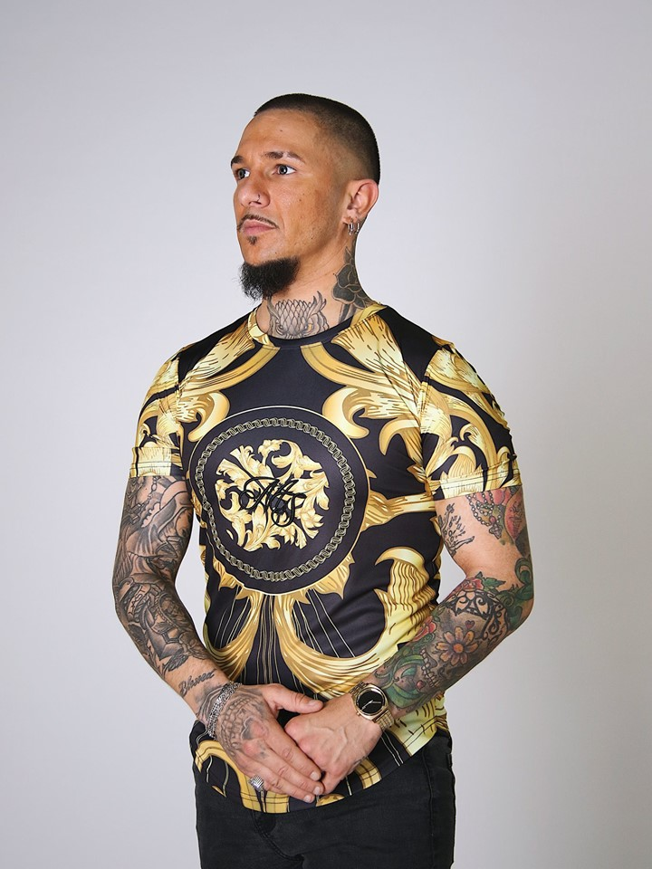

 

        

            <a href="#" class="close-button">&#10006;</a>
        <h2 class="textbot sete" style="width:60%;font-size:35px; color: black;align-self: center;padding: 20px 20px 20px 20px;text-align: center;">MEDO DE FICAR DE FORA?</h2>
        <h2 class="textbot" style="width:60%;font-size:15px; color: black;align-self: center;padding: 20px 20px 20px 20px;text-align: center;">Receba <bold>PORTES GRÁTIS</bold> em todas as compras ao subscrever!</h2>
<form class="newsletter" style="margin-bottom: 10px; margin-top: 10px;align-self: center;width:50%;display: flex;flex-direction: column;" method="POST" data-netlify="true" action="{{ site.url }}">
    <input class="placek" style="width:100%;text-align: center;" type="email" name="email" placeholder="Email">
    <input type="hidden" name="_after" value="{{ site.url }}">
    <input type="text" name="_honey" value="" style="display:none">
    
<input  style="text-align: center;-webkit-appearance: none;" class="certosoquenao" type="submit" name="form-name" value="JUNTA-TE AO GANG!">

</form>  
        

    

    

  

    <h6 class="textflow" style="font-size: 15px;">PORTES GRÁTIS ACIMA 40€!</h6> 
  

  

    <h6 class="textflow" style="font-size: 15px;">SEGUE-NOS NO <a href="https://www.instagram.com/gogogostore/"> INSTAGRAM!</a></h6>
  

  

    <h6 class="textflow" style="font-size: 15px;">INSCREVE-TE NA NOSSA NEWSLETTER E RECEBE 15%!</h6>  
  

                

 
<h1 style="font-size: 1px;z-index: -200; position: absolute; top: 0;">GOGOGO Store - Loja Online de Roupa Masculina</h1>

  

    

<a href="{{ site.url }}/saldos" class="slide active">
  

  <button class="newcl" style="font-family: 'Montserrat', sans-serif;
    position: absolute;
    top: 500px;
    color: white;
    display: flex;
    text-align: center;
    align-items: center;font-size: 30px;justify-content: center;text-shadow: 2px 2px black;">test</button>
</a>
<a href="{{ site.url }}/camisas" class="slide">
  

</a>
    <a href="{{ site.url }}/camisas" class="slide">
  

</a>
    

  

<a style="" href="{{ site.url }}/fatosdetreino">
  

  
  
<button class="submite" style="align-self: center;" onclick="location.href='{{ site.url }}/fatosdetreino/'">Shop Now</button>
  

</a>
<a href="{{ site.url }}/tshirts">
  

  
 
<button class="submite" style="align-self: center;" onclick="location.href='{{ site.url }}/tshirts/'">Shop Now</button>
  

</a>

<h2 style="  text-align: center;text-transform: uppercase;margin: 20px 0 20px 0;     font-family: 'Ropa Sans', sans-serif !important;
">TOP CHOICES</h2>

  
  
   <li data-oozer-filter="{{ t.att }} {{ t.color[0] }} {{ t.color[1] }} {{ t.discrip }}" class="prod item">
  

  
    

      <button class="snipcart-add-item thisbtn"
    data-item-id="{{ t.id }}"
    data-item-name="{{ t.name }}"
    data-item-price="{{ t.price }}"
    data-item-weight="{{ t.weight }}"
    data-item-custom2-name="Tamanho"
    data-item-custom2-options="S|M|L|XL"
    data-item-custom2-required="true"
    data-item-custom3-name="Cor"
    data-item-custom3-options="{{ t.color[0] }}"
    data-item-custom3-required="True"
    data-item-quantity="1"
    data-item-url="{{ site.url }}/products/{{ t.categoria }}/{{ t.att }}/{{ t.link }}"
    data-item-description="{{ t.discrip }}"
    data-item-image="{{ t.image }}">
    Adicionar ao carrinho   
</button>
<h4 class="h4name" style="display: flex;justify-content: space-around;" data-position="{{ t.price }}">{{ t.name }}
New
</h4>
      <h4 class="h4price" data-position="{{ t.price }}">Preço:{{ t.price }}0€</h4>
  
  

</li>

<a class="botdis" href="">
    

  
   
<button class="submite" style="align-self: flex-start; margin: 0 0 20px 60px;" onclick="location.href='{{ site.url }}/tshirts/'">Shop Collection</button>
  

</a>

<a class="botmob" href="">
    

  
   
<button class="submite" style="align-self: flex-start; margin: 0 0 20px 60px;" onclick="location.href='{{ site.url }}/tshirts/'">Shop Collection</button>
  

</a>

<h2 style="  text-align: center;text-transform: uppercase;margin: 20px 0 20px 0;     font-family: 'Ropa Sans', sans-serif !important;
">Hats and Caps</h2>

  
  
   <li data-oozer-filter="{{ t.att }} {{ t.color[0] }} {{ t.color[1] }} {{ t.discrip }}" class="prod item">
  

  
    

      <button class="snipcart-add-item thisbtn"
    data-item-id="{{ t.id }}"
    data-item-name="{{ t.name }}"
    data-item-price="{{ t.price }}"
    data-item-weight="{{ t.weight }}"
    data-item-custom2-name="Tamanho"
    data-item-custom2-options="S|M|L|XL"
    data-item-custom2-required="true"
    data-item-custom3-name="Cor"
    data-item-custom3-options="{{ t.color[0] }}"
    data-item-custom3-required="True"
    data-item-quantity="1"
    data-item-url="{{ site.url }}/products/{{ t.categoria }}/{{ t.att }}/{{ t.link }}"
    data-item-description="{{ t.discrip }}"
    data-item-image="{{ t.image }}">
    Adicionar ao carrinho   
</button>
<h4 class="h4name" style="display: flex;justify-content: space-around;" data-position="{{ t.price }}">{{ t.name }}
New
</h4>
      <h4 class="h4price" data-position="{{ t.price }}">Preço:{{ t.price }}0€</h4>
  
  

</li>

  <h2 style="  text-align: center;text-transform: uppercase;margin: 20px 0 20px 0;     font-family: 'Ropa Sans', sans-serif !important;
">FOLLOW US ON INSTAGRAM</h2>
  

  

  

  

  

  

  

<h2 style="  text-align: center;text-transform: uppercase;margin: 20px 0 20px 0;     font-family: 'Ropa Sans', sans-serif !important;
">GOGOGO LIFESTYLE</h2>



